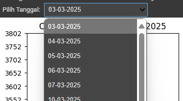

# Candlestick Shape Analysis

A Python project to analyze and visualize candlestick patterns from financial data in Google Spreadsheets. It detects patterns like Hammer, Hanging Man, and Doji, and generates candlestick charts with an interactive interface for technical analysis in trading.

## Overview

This project provides a Jupyter Notebook (`candle.ipynb`) that fetches financial data from a Google Spreadsheet, detects candlestick patterns, and visualizes them as charts. The script is designed to run in Google Colab, making it accessible for users without a local Python setup. However, setting up Google Cloud credentials and preparing the spreadsheet can be a bit tricky—follow the steps below to get started.

## Prerequisites

Before running the project, ensure you have the following:

- A Google account (for Google Colab and Google Sheets).
- Access to Google Colab.
- Basic familiarity with Jupyter Notebooks.

## Step-by-Step Setup Guide

### Step 1: Copy the Code

1. Open the `candle.ipynb` file in this repository.
2. Copy all the code cells into a new Google Colab notebook:
   - Go to Google Colab.
   - Create a new notebook.
   - Paste the code from `candle.ipynb` into the notebook cells.

### Step 2: Set Up Google Cloud Credentials

To access the Google Spreadsheet, you need to set up a Google Cloud project and obtain a service account JSON key. Follow these steps:

1. **Create a Google Cloud Project**:

   - Go to the Google [Cloud Console.](https://console.cloud.google.com)
   - Click **"New Project"**, give it a name (e.g., `CandlestickAnalysis`), and create the project.
   - Select the project from the dropdown at the top.

2. **Enable APIs**:

   - Go to **"APIs & Services"** &gt; **"Library"**.
   - Search for and enable the following APIs:
     - **Google Sheets API**
     - **Google Drive API**

3. **Create a Service Account**:

   - Go to **"IAM & Admin"** &gt; **"Service Accounts"**.
   - Click **"Create Service Account"**.
   - Fill in the details:
     - Service account name: `candlestick-access`
     - Service account ID: (auto-generated, e.g., `candlestick-access@your-project.iam.gserviceaccount.com`)
     - Description: (optional, e.g., "Access Google Sheets for candlestick analysis")
   - Click **"Create and Continue"**.
   - Skip the optional steps (roles and users) and click **"Done"**.

4. **Generate a JSON Key**:

   - In the Service Accounts list, click on the service account you just created (`candlestick-access`).
   - Go to the **"Keys"** tab.
   - Click **"Add Key"** &gt; **"Create new key"**.
   - Select **JSON** and click **"Create"**.
   - The JSON key file (e.g., `your-project-123456.json`) will be downloaded automatically. Rename it to `credentials.json` for simplicity.

### Step 3: Prepare the Google Spreadsheet

The script fetches data from a Google Spreadsheet. You need to create and share the spreadsheet with the service account.

1. **Create a Spreadsheet**:

   - Go to Google Sheets.
   - Create a new spreadsheet or you can see `sona-data-chard-ex.csv` and you can uploud on your spreadsheet.
   - Add the following column headers in the first row:
     - `date` (e.g., "04-03-2025")
     - `open_price` (e.g., 3320)
     - `close_price` (e.g., 3190)
     - `max_price` (e.g., 3350)
     - `min_price` (e.g., 3100)
   - Fill in the data rows with your financial data (at least one row for testing).

2. **Share the Spreadsheet**:

   - Copy the email address of your service account from the JSON key file (e.g., `candlestick-access@your-project.iam.gserviceaccount.com`).
   - In Google Sheets, click **"Share"** in the top-right corner.
   - Paste the service account email and set the permission to **"Editor"**.
   - Click **"Send"**.

3. **Get the Spreadsheet ID**:

   - Copy the Spreadsheet ID from the URL. For example, in the URL `https://docs.google.com/spreadsheets/d/abcdefghijklmnopqrstuvwxyz1234567890/edit`, the ID is `abcdefghijklmnopqrstuvwxyz1234567890`.
   - In the `candle.ipynb` code, replace the `SPREADSHEET_ID` (on the line below) with your Spreadsheet ID.
   ```bash 
   client.open_by_key('abcdefghijklmnopqrstuvwxyz1234567890')
   ```
   

### Step 4: Run the Code in Google Colab

1. **Execute the Notebook**:

   - Run all the cells in the notebook (click **"Runtime"** &gt; **"Run all"** or press `Ctrl+F9`).
   - The script will:
     - Connect to your Google Spreadsheet.
     - Fetch the data.
     - Detect candlestick patterns.
     - Display candlestick charts with a dropdown to select dates.
     - Provide a button to download the charts as PNG files.
2. **Upload the JSON Key**:

   - In Google Colab, run the first cell of the notebook (which contains `uploaded = files.upload()`).
   - A file upload prompt will appear—upload the `credentials.json` file you downloaded earlier.
   

### Step 5: Interpret the Results

- Use the dropdown menu to select a date and view the candlestick chart for that date (according to the date data in your spreadsheet).

- The chart will display the candlestick pattern (e.g., "Hanging Man", "Doji") along with the price details.
- Click the "Download Chart" button to save the chart as a PNG file with name `candlestick.png`.


## Example Result After Download
- You can check on folder [pic/the-result](https://github.com/kevinnaufaldany/candlestick-shape-analysis/tree/main/pic/the-result)

## Troubleshooting

- **SpreadsheetNotFound Error**: Ensure the Spreadsheet ID is correct and the spreadsheet is shared with the service account email.
- **KeyError for Columns**: Verify that your spreadsheet has the required columns (`date`, `open_price`, `close_price`, `max_price`, `min_price`).
- **Permission Denied**: Double-check that the service account has "Editor" access to the spreadsheet.

## Future Improvements

- Add support for more candlestick patterns (e.g., Long-Legged Doji).
- Implement trend analysis for better trading insights.
- Port the script to run locally without Google Colab.

## Contributing

Contributions are welcome! Feel free to open an issue or submit a pull request with improvements or bug fixes.

## Authors
- [@kevinnaufaldany](https://github.com/kevinnaufaldany)